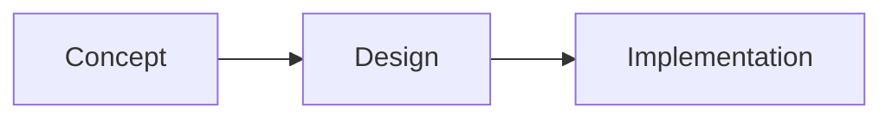

# 🛸 U.S.S. SIDDHARTH // PUBLISHING GUIDE

This project uses a filesystem-based Markdown workflow. To add content, simply add files to the folders and push to GitHub.

## 🚀 How to Add New Posts

1.  **Navigate to the content folder**: Choose the appropriate category (e.g., `content/Design Projects/Interfaces`).
2.  **Create a new file**: Name it something like `my-new-project.md`.
3.  **Add Frontmatter**: Every file *must* start with this block:
    ```markdown
    ---
    id: unique-id-123
    title: My Project Title
    date: 2026-02-25
    summary: A short blurb for the search index.
    ---
    ```
4.  **Write your content**: Use standard Markdown below the second `---`.

## 📂 Structure & Organization
*   **Collections**: The first folder level (e.g., `Design`) becomes the main header in the sidebar.
*   **Sub-Collections**: The second folder level (e.g., `Humanist Funerals in Sweden`) becomes the indented category header.
*   **Images**: Organise images into subfolders within `assets/images/posts/` named after the post's slug or ID.
    *   **Folder**: `assets/images/posts/[post-id-or-slug]/`
    *   **Linking**: Use **absolute paths** (starting with `/`) in Markdown:
        ``
    *   **Benefit**: This prevents file name conflicts and keeps the assets directory clean.

## ✍️ Formatting Tips

### 📊 Mermaid.js Diagrams
Create live flowcharts by using `mermaid` code blocks:
~~~markdown

~~~

### ✨ Typography
*   Use `### Header` for section titles within articles (matches the LCARS dashboard style).
*   Use **bold** for emphasis on techno-optimist keywords.

## 🛠️ Deployment Logic
*   **Locally**: Run `python build.py` to refresh the site immediately while you are editing.
*   **Live**: Just `git push`. A GitHub Action will automatically run the build script and update your dashboard live on the web!
